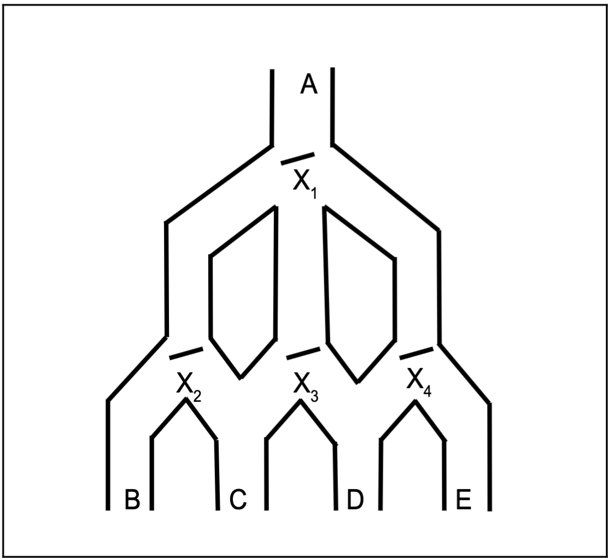

# Marble Machine Simulation

## Overview  
This project simulates a **marble machine game** where marbles are dropped down a chute and interact with a set of gates. Each gate toggles between states as marbles pass through, affecting the final exit chute. The game follows these rules:

- A marble is dropped down **chute A**.
- Gates **X1, X2, X3, and X4** toggle when a marble passes through.
- **X1** has three possible states: Left, Center, and Right.
- **X2, X3, and X4** toggle between Left and Right.
- The final exit chute determines the game outcome:
  - **Win:** Marble exits through **B or D**.
  - **Lose:** Marble exits through **C or E**.

The simulation processes an input sequence of `0`s and `1`s to determine how the gates toggle and the final marble exit.



## Files
- `eskenazi_p2.cpp` - The main C++ program implementing the marble simulation.
- `makefile` - Defines build rules for compiling the program.
- `cs373-programming assignment 2.pdf` - The assignment description with problem details.
- `marble-machine.png` - A diagram of the marble machine.

## Compilation  
Use `make` to build the project:

```sh
make
```
This will generate the executable file **`eskenazi_p2`**.

To clean up compiled files:
```sh
make clean
```

## Usage  
Run the program with an initial gate configuration and an input sequence:

```sh
./eskenazi_p2 <initial_state> <input_string>
```

### Example Runs  
```sh
./eskenazi_p2 LLLL 0000
```
Output:
```
LLLL->RRLL->CRLR->LRRR->RLRR C
```

```sh
./eskenazi_p2 LLLL 1111
```
Output:
```
LLLL->CRLL->RRRL->LRRR->CLRR C
```

To run all predefined test cases:
```sh
./eskenazi_p2 test
```

## Input Format
- **Initial State:** Four characters representing the gate positions:
  - `X1`: `L` (Left), `C` (Center), `R` (Right)
  - `X2`, `X3`, `X4`: `L` (Left) or `R` (Right)
- **Input String:** A sequence of `0`s and `1`s that simulates marbles being dropped.

## Rules Recap
- **X1 toggles based on input:**
  - `0`: L → R → C → L (cycle)
  - `1`: L → C → R → L (cycle)
- **X2, X3, X4 toggle between L and R each time a marble passes.**
- **Winning Exit Chutes:** B, D
- **Losing Exit Chutes:** C, E

